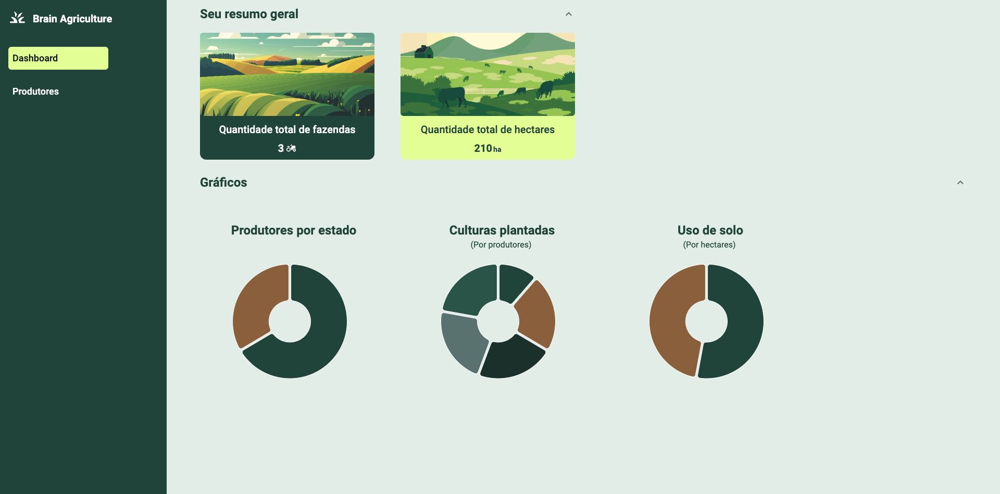
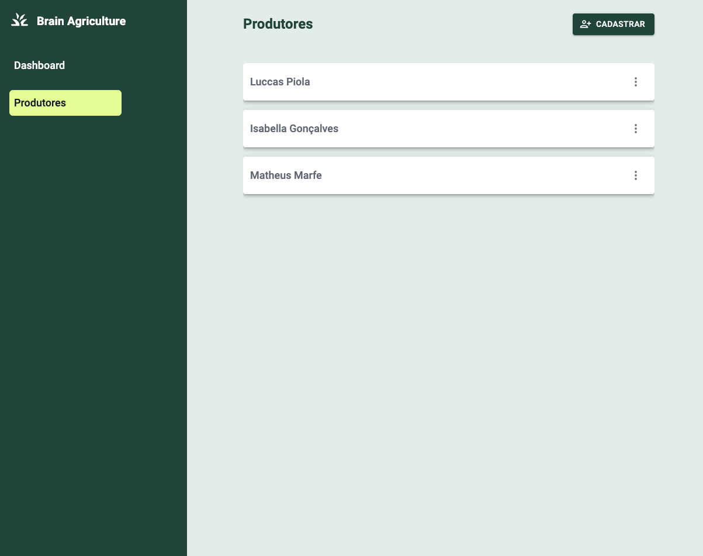
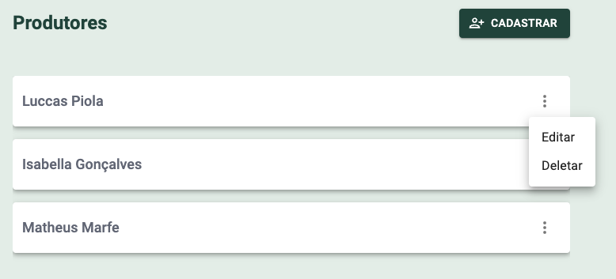
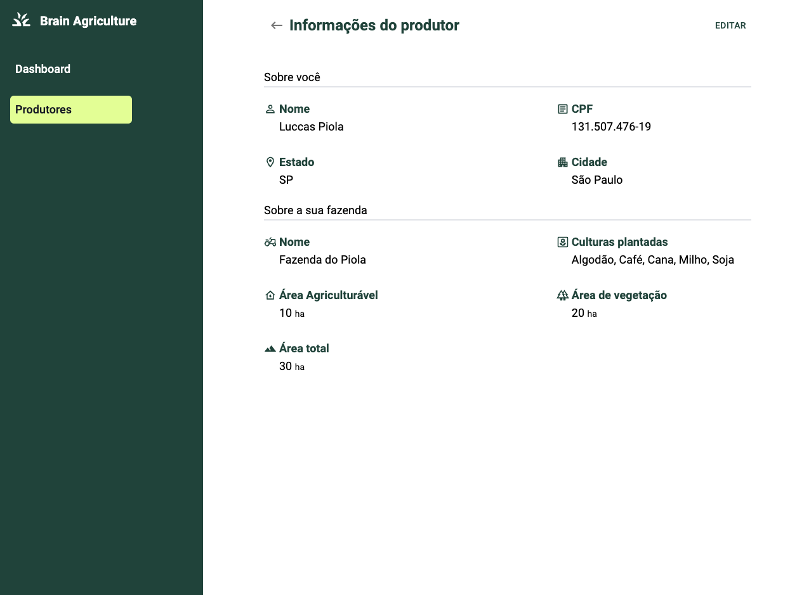
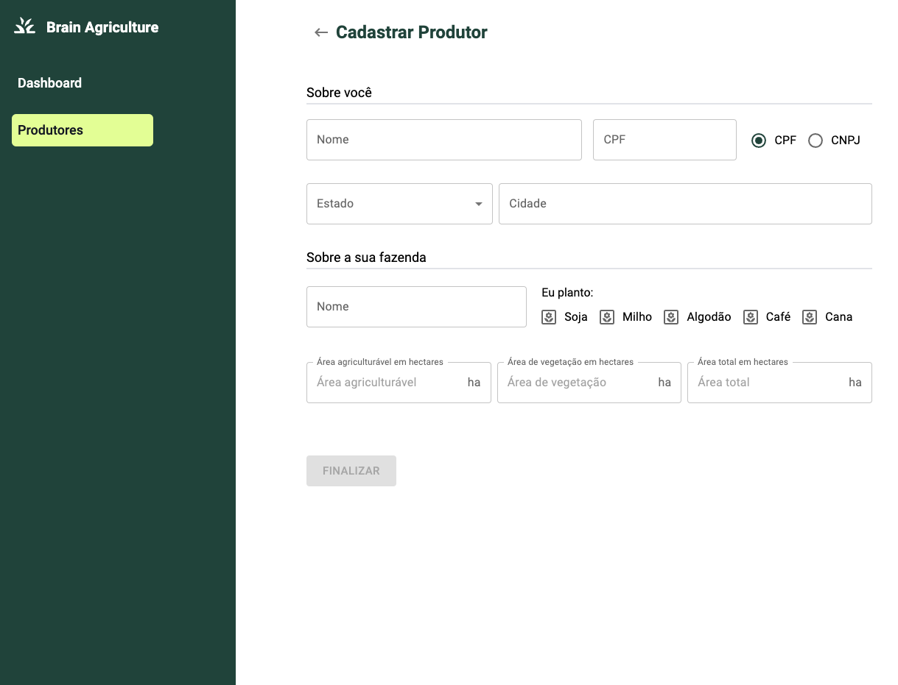
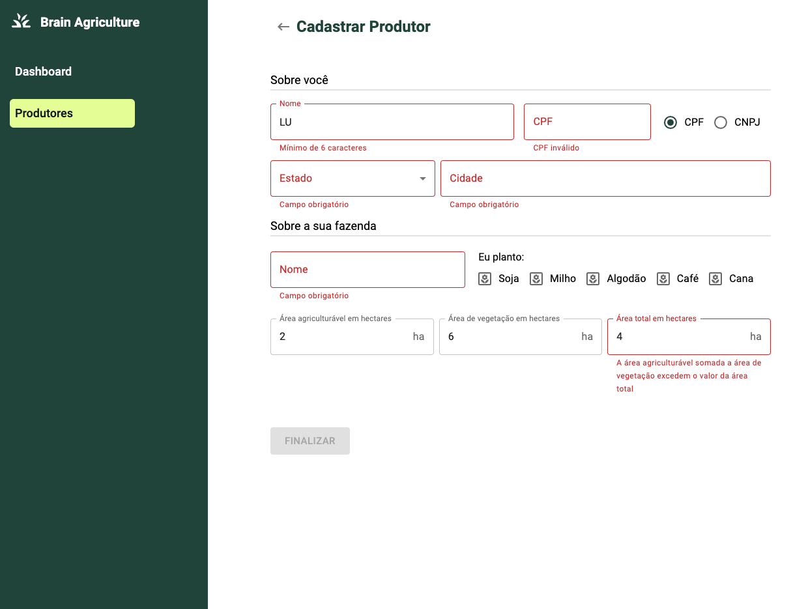

<h1 align="center">
  
</h1>

<h3 align="center">
  Teste para a Brain.ag utilizando React + Vite + Typescript + Redux
</h3>

Repostório dedicado para realizar o teste proposto pela 
Brain.ag, utilizando React.

<blockquote align="center">“Programs must be written for people to read, and only incidentally for machines to execute.” ― Harold Abelson</blockquote>

  <a href="#sobre-o-teste">Sobre o teste</a>&nbsp;&nbsp;&nbsp;|&nbsp;&nbsp;&nbsp;
  <a href="#funcionamento">Funcionamento</a>&nbsp;&nbsp;&nbsp;|&nbsp;&nbsp;&nbsp;
  <a href="#ver-funcionando">Ver funcionando</a>

## Sobre o teste

Esse é o teste proposto pela [Brain.ag](https://www.brain.agr.br/), com o intuito de analisar
e contratar um Engenheiro de Software Front-end.

O teste consistia no desenvolvimento de uma aplicação onde fosse possível cadastrar
produtores rurais, com dados pessoais e dados sobre a fazenda do produtor.

### **Tecnologias utilizadas para o teste**

- :green_heart: &nbsp;**[Vite](https://vitejs.dev/)** — Ferramenta para geração do ambiente de desenvolvimento Front-End, nesse caso, com React.
- :purple_heart: &nbsp;**[Tailwind](https://tailwindcss.com/)** — Biblioteca para estilização de elementos.
- :yellow_heart: &nbsp;**[MUI](https://mui.com/)** — Biblioteca de componentes prontos para React.
- :blue_heart: &nbsp;**[TypeScript](https://www.typescriptlang.org/)** - Superset de JS para tipagem e melhoria de arquitetura.
- :heart: &nbsp;**[json-server](https://github.com/typicode/json-server)** - Tecnologia para a criação de uma API REST fake.

## Funcionamento

Em primeira instância, possuímos um dashboard, responsável por mostrar algumas informações
importantes, como gráficos e total de fazendas. Os gráficos só aparecem quando o número de produtores cadastrados é pelo menos 1.

<h1 align="center">
  
</h1>

Além disso, temos uma área responsável por listar os produtores cadastrados.

<h1 align="center">
  
</h1>

Cada produtor pode ser editado ou excluído por meio do menu de contexto.

<h1 align="center">
  
</h1>

Além disso, pode-se visualizar as informações de cada produtor.

<h1 align="center">
  
</h1>

E também cadastrar novos produtores.

<h1 align="center">
  
</h1>

Há várias verificações nos inputs, como validação de CPF e validação da soma das áreas da fazenda.
Essas são mostradas de maneira intuitiva para o usuário

<h1 align="center">
  
</h1>

## Ver funcionando

Um vídeo simples do funcionamento da aplicação:

https://github.com/LuccasPiola/brain-agriculture/assets/37879484/2e61c7c8-9495-4632-b70a-416cf7653be3

Para análise de código, este repositório foi criado utilizando a arquitetura de componentização. Sobre a arquitetura de pastas:

- _components_ - Componentes reutilizáveis da aplicação.
- _lib_ - Funções puras úteis para cálculos complexos e transformações de dados.
- _types_ - Tipagens globais da aplicação.
- _pages_ - Páginas da aplicação.
- _store_ - Funções redutoras referentes à Redux Toolkit.
- _db.json_ - Banco de dados fake utilizado pelo json-server.

Para análise e ver funcionando diretamente na máquina local:

1. Clone este repositório utilizando o comando <code>git clone https://github.com/LuccasPiola/brain-agriculture.git</code>
2. Entre na pasta clonada utilizando <code>cd brain-agriculture</code>
3. Rode o comando <code>npm i</code> no terminal, para a instalação das dependências  
   &nbsp; &nbsp; 3.1 Versão utilizada do Node: **18.17.1**  
4. Rode o comando <code>npm run brain</code> no terminal. Isso fará um build da aplicação e disponibilizará uma versão otimizada em <code>http://localhost:4174/</code>, além de rodar
   a API na porta 3004.

---

This test was made by Brain.ag. Repository by Luccas Piola. ♥ &nbsp;for JavaScript.
